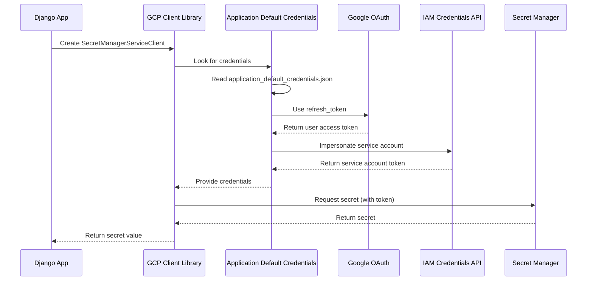

# GCP Services Module

This module provides integration with Google Cloud Platform services using automatic token generation.

## Overview

The GCP services use **Application Default Credentials (ADC)** with **service account impersonation** to provide:

- 🔐 Automatic access token generation
- ♻️ Automatic token refresh (every ~1 hour)
- 🔒 Secure credential storage in Secret Manager
- 📦 Cloud Storage integration
- 🗄️ Database credential management

## Architecture

```
Django Application
    ↓
gcp_utils.py → Secret Manager Client
    ↓              Cloud Storage Client
    ↓              ADC Validator
    ↓
database_config.py → Database Configuration
    ↓                  Credential Retrieval
    ↓
Application Default Credentials (ADC)
    ↓
Service Account Impersonation
    ↓
Auto-Generated Access Tokens
    ↓
GCP APIs (Secret Manager, Cloud Storage, etc.)
```

## Modules

### 1. `gcp_utils.py`

**Core GCP utilities with auto-token generation.**

#### Classes:

##### `GCPSecretManager`
Manages secrets in GCP Secret Manager with automatic authentication.

```python
from apps.core.services.gcp_utils import GCPSecretManager

# Initialize
secret_manager = GCPSecretManager(project_id='mtech-marketing-mrm-np')

# Retrieve secret - token automatically generated and used
password = secret_manager.get_secret('mrm_app_db_qa_pass')

# Retrieve JSON secret
config = secret_manager.get_secret_json('app_config')

# Close client
secret_manager.close()
```

**Key Features:**
- Automatic token generation via ADC
- Token refresh handled transparently
- Lazy client initialization
- Support for versioned secrets

##### `GCPStorage`
Manages files in Google Cloud Storage with automatic authentication.

```python
from apps.core.services.gcp_utils import GCPStorage

# Initialize
storage = GCPStorage(bucket_name='my-bucket')

# Upload file
storage.upload_file('local/file.pdf', 'remote/file.pdf')

# Upload bytes
storage.upload_bytes(file_bytes, 'remote/file.pdf', content_type='application/pdf')

# Download file
storage.download_file('remote/file.pdf', 'local/file.pdf')

# Download bytes
content = storage.download_bytes('remote/file.pdf')

# List files
files = storage.list_files(prefix='uploads/')

# Delete file
storage.delete_file('remote/file.pdf')
```

**Key Features:**
- Automatic token management
- File and byte operations
- List and filter files
- Content type handling

##### `ADCValidator`
Validates Application Default Credentials configuration.

```python
from apps.core.services.gcp_utils import ADCValidator

# Validate credentials
is_valid, message = ADCValidator.validate_adc()
if is_valid:
    print(f"✓ {message}")
else:
    print(f"✗ {message}")

# Get detailed info
info = ADCValidator.get_adc_info()
print(f"Project: {info['project']}")
print(f"Type: {info['type']}")
print(f"Valid: {info['valid']}")
```

**Returns:**
```python
{
    "adc_file_env": "./application_default_credentials.json",
    "project_id_env": "mtech-marketing-mrm-np",
    "valid": True,
    "project": "mtech-marketing-mrm-np",
    "type": "impersonated_service_account",
    "service_account": "mrm-masplan-service-qa-sa@..."
}
```

#### Convenience Functions:

```python
from apps.core.services.gcp_utils import get_secret, validate_gcp_credentials

# Quick secret retrieval
password = get_secret('mrm_app_db_qa_pass')

# Quick validation
is_valid = validate_gcp_credentials()
```

---

### 2. `database_config.py`

**Database configuration with GCP Secret Manager integration.**

#### Classes:

##### `DatabaseConfig`
Manages database configuration with automatic credential retrieval.

```python
from apps.core.services.database_config import DatabaseConfig

# Initialize
config_manager = DatabaseConfig()

# Get database configuration for Django
db_config = config_manager.get_database_config()

# Returns:
{
    'ENGINE': 'django.db.backends.postgresql',
    'NAME': 'mrmqadb',
    'USER': 'mrmqadb_app',
    'PASSWORD': '<retrieved from Secret Manager>',
    'HOST': 'cloudsql-mrm-qa...',
    'PORT': '5432',
    'OPTIONS': {...},
    'CONN_MAX_AGE': 600
}
```

**Behavior:**
- If `USE_GCP_SECRETS=True`: Retrieves password from Secret Manager
- If `USE_GCP_SECRETS=False`: Uses local `.env` configuration
- Automatically handles MySQL and PostgreSQL differences

##### `GCPDatabaseValidator`
Validates database configuration and tests connectivity.

```python
from apps.core.services.database_config import GCPDatabaseValidator

# Validate configuration
is_valid, message = GCPDatabaseValidator.validate_config()
print(message)
# Output: "GCP database configuration is valid"

# Test database connection
is_connected, message = GCPDatabaseValidator.test_connection()
print(message)
# Output: "Database connection successful"
```

#### Convenience Functions:

```python
from apps.core.services.database_config import get_database_config, validate_database_setup

# Get configuration
config = get_database_config()

# Validate setup
is_valid = validate_database_setup()
```

---

## Token Generation Flow

### How Auto-Token Works



### Token Lifecycle

1. **First Request**
   - Client library initializes
   - Reads ADC configuration
   - Uses `refresh_token` to get user token
   - Calls IAM Credentials API
   - Impersonates service account
   - Caches resulting token

2. **Subsequent Requests**
   - Uses cached token
   - Token valid for ~1 hour
   - Automatically refreshed 5 minutes before expiration

3. **Token Refresh**
   - Happens automatically
   - Uses same flow as first request
   - Transparent to application
   - No code changes needed

---

## Usage in Django

### Settings Configuration

```python
# config/settings.py

# Enable GCP integration
USE_GCP_SECRETS = os.getenv('USE_GCP_SECRETS', 'False').lower() == 'true'

if USE_GCP_SECRETS:
    from apps.core.services.database_config import get_database_config
    
    DATABASES = {
        'default': get_database_config()
    }
```

### Environment Variables

```bash
# .env

# Enable GCP
USE_GCP_SECRETS=True

# GCP Configuration
GCP_PROJECT_ID=mtech-marketing-mrm-np
GOOGLE_APPLICATION_CREDENTIALS=./application_default_credentials.json

# Database
DB_HOST=cloudsql-mrm-qa.mtech-marketing-mrm-np.project-internal
DB_NAME=mrmqadb
DB_USER=mrmqadb_app
DB_PASSWORD_SECRET_ID=mrm_app_db_qa_pass
```

---

## Error Handling

### Common Errors

#### 1. DefaultCredentialsError
```python
google.auth.exceptions.DefaultCredentialsError: Could not automatically determine credentials
```

**Cause:** Missing or invalid `application_default_credentials.json`

**Solution:**
```bash
gcloud auth application-default login
# Then configure application_default_credentials.json
```

#### 2. PermissionDenied
```python
google.api_core.exceptions.PermissionDenied: 403 Permission 'secretmanager.versions.access' denied
```

**Cause:** Service account lacks required IAM role

**Solution:**
```bash
gcloud projects add-iam-policy-binding PROJECT_ID \
  --member="serviceAccount:SA_EMAIL" \
  --role="roles/secretmanager.secretAccessor"
```

#### 3. RefreshError
```python
google.auth.exceptions.RefreshError: Unable to impersonate service account
```

**Cause:** User doesn't have permission to impersonate service account

**Solution:**
```bash
gcloud iam service-accounts add-iam-policy-binding SA_EMAIL \
  --member="user:YOUR_EMAIL" \
  --role="roles/iam.serviceAccountTokenCreator"
```

---

## Testing

### Unit Testing

```python
# tests/test_gcp_utils.py

import pytest
from apps.core.services.gcp_utils import GCPSecretManager, ADCValidator

def test_adc_validation():
    is_valid, message = ADCValidator.validate_adc()
    assert is_valid, f"ADC validation failed: {message}"

def test_secret_retrieval():
    sm = GCPSecretManager()
    try:
        secret = sm.get_secret('mrm_app_db_qa_pass')
        assert len(secret) > 0
    finally:
        sm.close()

def test_database_config():
    from apps.core.services.database_config import get_database_config
    config = get_database_config()
    assert config['ENGINE'] == 'django.db.backends.postgresql'
    assert 'PASSWORD' in config
```

### Manual Testing

```bash
# Validate setup
python manage.py validate_gcp_setup

# Test in shell
python manage.py shell

>>> from apps.core.services.gcp_utils import get_secret
>>> password = get_secret('mrm_app_db_qa_pass')
>>> print(f"✓ Retrieved {len(password)} characters")
```

---

## Security Considerations

### Best Practices

✅ **DO:**
- Use service account impersonation (not keys)
- Store credentials in Secret Manager
- Rotate refresh tokens regularly
- Use separate service accounts per environment
- Grant minimal required IAM permissions
- Add `application_default_credentials.json` to `.gitignore`

❌ **DON'T:**
- Commit credentials to version control
- Share refresh tokens
- Use service account JSON keys
- Grant overly broad IAM permissions
- Use production credentials in development

### IAM Roles Required

**Service Account:**
- `roles/secretmanager.secretAccessor` - Read secrets
- `roles/cloudsql.client` - Connect to CloudSQL
- `roles/storage.objectAdmin` - Access Cloud Storage

**Your User:**
- `roles/iam.serviceAccountTokenCreator` - Impersonate service account

---

## Monitoring & Debugging

### Enable Debug Logging

```python
# config/settings.py

LOGGING = {
    'loggers': {
        'google.auth': {
            'handlers': ['console'],
            'level': 'DEBUG',
        },
        'apps.core.services': {
            'handlers': ['console'],
            'level': 'DEBUG',
        },
    },
}
```

### Check Token Generation

```python
from google.auth import default
import google.auth.transport.requests

credentials, project = default()
print(f"Project: {project}")
print(f"Valid: {credentials.valid}")
print(f"Expired: {credentials.expired}")

# Force refresh
request = google.auth.transport.requests.Request()
credentials.refresh(request)
print(f"Token refreshed: {credentials.valid}")
```

---

## Dependencies

```python
# requirements.txt
google-cloud-secret-manager==2.20.0
google-cloud-storage==2.14.0
google-auth==2.29.0
psycopg2-binary==2.9.9
```

---

## Additional Resources

- **Quick Start:** [GCP_QUICK_START.md](../../../GCP_QUICK_START.md)
- **Full Documentation:** [GCP_DATABASE_SETUP.md](../../../GCP_DATABASE_SETUP.md)
- **Google Cloud Docs:** https://cloud.google.com/docs/authentication
- **Secret Manager:** https://cloud.google.com/secret-manager/docs

---

**Module Version:** 1.0  
**Last Updated:** January 2026
